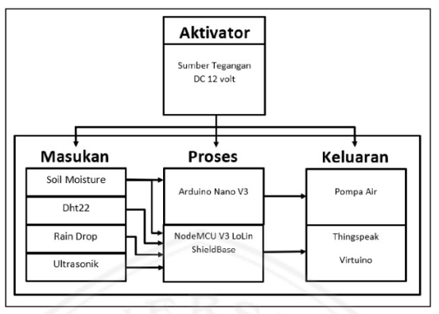
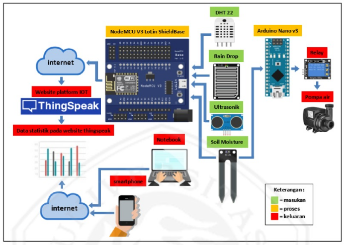
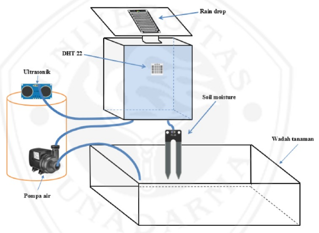

# IoT Based Smart Irrigation System using ESP8266 with ThingSpeak Platform

This project integrates an Arduino-based water pump control system with an ESP8266-based sensor and data logging system using the ThingSpeak platform. The system monitors soil moisture, air temperature, humidity, and other environmental conditions to manage irrigation efficiently.

## Block Diagram



## Components

- Arduino board (e.g., Arduino Nano)
- ESP8266 NodeMCU Lolin V3 (or similar)
- DHT22 Temperature and Humidity Sensor
- HC-SR04 Ultrasonic Distance Sensor
- Soil Moisture Sensor
- Rain Sensor
- Relay Module (for controlling the water pump)
- Various jumper wires and a breadboard

## Schema



## Mockup Prototipe



## Features

Here’s a concise summary of the features in bullet points:

- Automated Water Pump Control: Controls the water pump based on soil moisture levels.
- Environmental Monitoring: Measures air temperature, humidity, soil moisture, rain conditions, and water status using various sensors.
- ThingSpeak Integration: Logs and analyzes sensor data in real-time on the ThingSpeak platform.
- Remote Access: Provides remote data access and monitoring via WiFi.
- Efficient Irrigation Management: Activates/deactivates the water pump based on moisture thresholds to optimize water use.
- Live Data and Debugging: Offers real-time data monitoring and debugging through ThingSpeak and the serial monitor.

## Code Description

### 1. Arduino Code (`arduino-code.ino`)

This code controls a water pump based on soil moisture levels read from a soil moisture sensor.

#### Pin Definitions

- `waterPump` - Digital pin 2, controls the relay module for the water pump.

#### Functionality

- Reads the soil moisture level from an analog sensor connected to pin A0.
- Turns the water pump on if the soil moisture is below a certain threshold (350), and turns it off if it is above this threshold.
- Sends the soil moisture readings to the serial monitor for debugging purposes.

#### Code

```cpp
int waterPump = 2;

void setup(){
    Serial.begin(9600);
    pinMode(waterPump, OUTPUT);
}

void loop(){
    int sensorValue = analogRead(A0);
    Serial.println(sensorValue);

    if (sensorValue > 350){
        digitalWrite(waterPump, LOW);
    }
    else{
        digitalWrite(waterPump, HIGH);
    }
    delay(100);
}
```

### 2. ESP8266 Code (esp8266-code.ino)

#### Code

```cpp
// Code NodeMCU ESP8266 V.3 Lolin ShieldBase

#include "DHT.h"
#include <ESP8266WiFi.h>
#include <WifiClient.h>
#include <ThingSpeak.h>

#define trigPin D6
#define echoPin D7
#define DHTPIN D8
#define DHTTYPE DHT22
DHT dht(DHTPIN, DHTTYPE);

int soilPin = A0;
int rainPin = D4;

const char* ssid = "Veendy-Suseno";
const char* password = "Admin12345";

WiFiClient client;
unsigned long myChannelNumber = 796481;
const char* myWriteAPIKey = "S3CO1YQPOTQCJURV";

void setup(){
    Serial.begin(9600);
    dht.begin();
    pinMode(soilPin, INPUT);
    pinMode(rainPin, INPUT);
    pinMode(trigPin, OUTPUT);
    pinMode(echoPin, INPUT);
    delay(10);

    Serial.println(ssid);
    WiFi.begin(ssid, password);
    while (WiFi.status() != WL_CONNECTED) {
        delay(500);
        Serial.print(".");
    }
    Serial.println("");
    Serial.println("WiFi Connected");
    // Print the IP Address
    Serial.println(WiFi.localIP());
    ThingSpeak.begin(client);
}

void loop(){
    int temperatureValue = dht.readTemperature();
    int humidityValue = dht.readHumidity();
    int soilValue = analogRead(soilPin);
    int soilMoistureValue = (100 - ((soilValue / 1023.00) * 100));
    int rainValue = digitalRead(rainPin);

    long duration, distanceValue;
    digitalWrite(trigPin, LOW);
    delayMicroseconds(2);
    digitalWrite(trigPin, HIGH);
    delayMicroseconds(10);
    digitalWrite(trigPin, LOW);
    duration = pulseIn(echoPin, HIGH);
    distanceValue = ((duration / 2) / 29.1);

    Serial.print("Air Temperature = ");
    Serial.print(temperatureValue);
    Serial.print(" C");
    Serial.print(" Air Humidity = ");
    Serial.print(humidityValue);
    Serial.print(" % RH");
    Serial.print(" Soil-Moisture = ");
    Serial.print(soilMoistureValue);
    Serial.print(" %");
    Serial.print(" Soil Value = ");
    Serial.println(soilValue);
    Serial.print("Weather Conditions = ");
    Serial.println(rainValue);
    Serial.print("Water Status = ");
    Serial.println(distanceValue);

    ThingSpeak.setField(1, temperatureValue);
    ThingSpeak.setField(2, humidityValue);
    ThingSpeak.setField(3, soilMoistureValue);
    ThingSpeak.setField(4, rainValue);
    ThingSpeak.setField(5, distanceValue);
    ThingSpeak.writeFields(myChannelNumber, myWriteAPIKey);
    delay(15000); // 15 seconds default ThingSpeak Free
}

```

This code reads environmental data and sends it to the ThingSpeak platform for monitoring and analysis.
Pin Definitions

- trigPin - Digital pin D6, used for triggering the ultrasonic sensor.
- echoPin - Digital pin D7, used for receiving the echo from the ultrasonic sensor.
- DHTPIN - Digital pin D8, connected to the DHT22 sensor for temperature and humidity readings.
- soilPin - Analog pin A0, connected to the soil moisture sensor.
- rainPin - Digital pin D4, connected to the rain sensor.

### WiFi and ThingSpeak Configuration

- ssid - Your WiFi network name.
- password - Your WiFi network password.
- myChannelNumber - ThingSpeak channel number.
- myWriteAPIKey - ThingSpeak write API key.

### Functionality

- Connects to WiFi and ThingSpeak.
- Reads temperature and humidity from the DHT22 sensor.
- Reads soil moisture level from the soil sensor.
- Measures distance using the HC-SR04 sensor.
- Reads rain sensor data.
- Sends the collected data to ThingSpeak every 15 seconds for monitoring.

<hr/>

## How to Use

1. Arduino Setup:

   - Connect the soil moisture sensor to analog pin A0.
   - Connect the relay module for the water pump to digital pin 2.
   - Upload the arduino-code.ino to your Arduino board.

2. ESP8266 Setup:

   - Connect the DHT22 sensor to digital pin D8.
   - Connect the soil moisture sensor to analog pin A0.
   - Connect the ultrasonic sensor to digital pins D6 (trigger) and D7 (echo).
   - Connect the rain sensor to digital pin D4.
   - Update the ssid, password, myChannelNumber, and myWriteAPIKey with your own WiFi and ThingSpeak credentials.
   - Upload the esp8266-code.ino to your ESP8266 NodeMCU.

3. Monitoring:
   - Open the ThingSpeak channel to monitor the sensor data in real-time.
   - Observe the Arduino serial monitor for soil moisture readings and water pump status.

<hr/>
## Notes

- Ensure your WiFi and ThingSpeak credentials are correctly set in the ESP8266 code.
- Adjust the soil moisture threshold in the Arduino code as needed for your specific application.
- The ThingSpeak free account has a limit of one update every 15 seconds.
